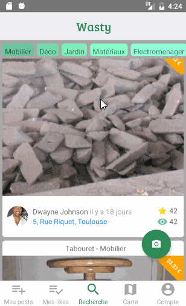
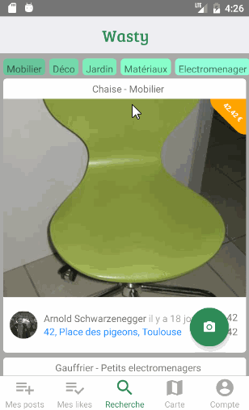
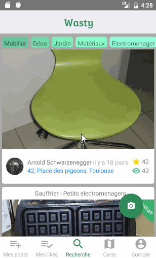
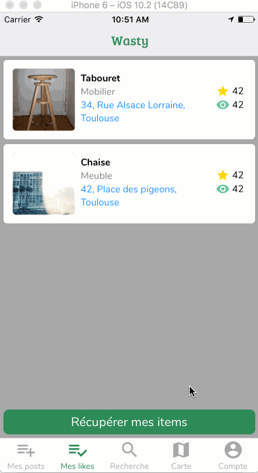
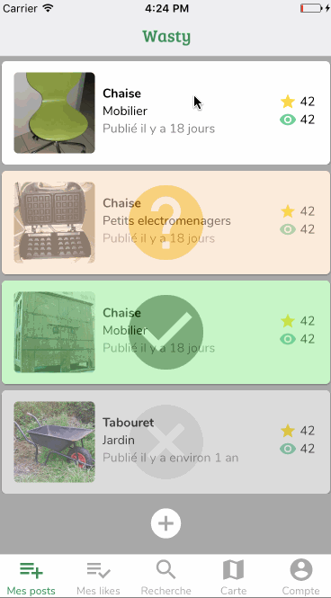
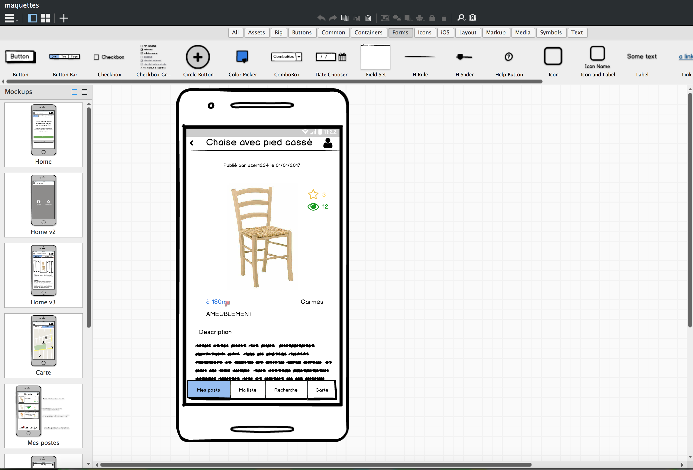

  

    
  

  

    
    
  

# Application mobile pour le projet Wasty (2017)

Cette partie du projet a été développée par le groupe 2 dont les membres sont:

- Axel Bellec
- Elise Benois
- Max Halford
- Pierrick Herve
- Antoine Plissonneau
- Raphaël Sourty

Le dossier [docs](docs/) contient le [planning prévisionnel](docs/Initial_planning.pdf) et le [planning réel](docs/Final_planning.pdf). Il contient aussi les [spécifications initiales](docs/Specifications.pdf) et quelques [ressources](docs/Resources.md) et [spécifications](docs/Specifications.pdf) que l'on a utilisé pour lancer le projet.

## Stack technologique

Nous avons décidé une technologie assez récente et très en vogue qui s'appelle **React Native**. En bref React Native permet de développer des applications en JavaScript et de lancer sur un mobile qui dispose d'un interpréteur JavaScript.

La magie de React Native est que l'on peut dorénavant utiliser l'ensemble de l'écosystème JavaScript pour développer notre application. On a donc accès à [Webpack](https://webpack.github.io/docs/) pour gérer nos dépendances, [Babel](https://babeljs.io/) pour coder avec la spécification [ES6](http://es6-features.org/) de JavaScript, [lodash](https://lodash.com/) pour coder avec un paradigme fonctionnel, [moment](http://momentjs.com/) pour manipuler des dates, etc.

Une application React Native peut donc tourner sous Android aussi bien que sous iOS et Windows Phone. On gagne énormément en temps de développement si on veut développer une application multi-plateformes. Lors des deux semaines de projet nous avions trois développeurs qui étaient sous Android et 3 autres sous iOS. De cette façon nous avons pu vérifier en continu que tous nos changements marchaient sur les deux plateformes.

L'application peut être testée très facilement et simplement à l'aide d'un émulateur de téléphone. Il n'y a pas besoin de recompiler l'application à chaque modification. Il nous suffit d'enregistrer le fichier contenant pour voir apparaître nos changements; c'est ce qu'on appelle le *hot reloading*.

Le react native est un langage jeune (moins de 2 ans), la petite taille de la communauté peut poser problème. Néanmoins, ce langage a été développé par une entreprise importante, Facebook, c'est donc un gage de qualité qui compense sa jeunesse. De plus React-Native est le langage qui a le plus progressé en utilisation selon le rencesement StackOverflow de 2016.

## Architecture

### Authentification

Nous voulions donner la possibilité à un utilisateur de créer un compte et de se connecter à l'application. Cela est d'autant plus nécessaire pour enregistrer des données d'utilisation et de personnaliser l'application selon l'utilisateur.

Hélas nous n'avons pas eu le temps de complètement gérer cette fonctionnalité à 100% puisqu'elle est intimement reliée à l'application serveur qui n'était pas prête. Pour contourner le problème nous avons simulé une requête vers le serveur pour récupérer des données utilisateur en supposant qu'il était connecté.

Nous avons néanmoins codé une grande partie de la partie visuelle du parcours utilisateur concernant l'authentification. Pour cette partie nous nous sommes donc surout concentré sur la partie visuelle.

### Page "Recherche"

L'utilisateur se trouve sur la page "Recherche" lorsqu'il lance l'application.

Cette page a pour objectif de mettre en relation ceux qui proposent des objets et ceux qui en recherchent. On présente d'abord à l'utilisateur des annonces qui sont censées lui "correspondre"; le serveur se charge de cette partie si on lui donne un identifiant utilisateur. L'utilisateur peut aussi filtrer des annonces selon leurs catégories.

La fonctionnalité de recherche de la page "Recherche" se distingue grâce à un système de catégorisation. Nous avons mis en place un moteur de recherche sur le modèle du réseau social "Pinterest". Les catégories sont représentées sous forme de blocs. Ces blocs caractérisent les différentes catégories (verre, chaise, habits...). Lorsque l'utilisateur clique sur un bloc, la page de recherche s'adapte en fonction des critères de l'utilisateurs.

Idéalement nous aimerions que les six premières catégories affichées évoluent en fonction de l'utilisateur à partir d'un algorithme d'apprentissage.

Nous avons choisi de laisser une surface importante aux photos des objets pour que les utilisateurs puissent rapidement identifier les objets auxquels ils offriront une seconde vie.

Nous avons imaginé une solution pour que ceux qui cherchent des objets puissent distinguer rapidement les objets payants de ceux qui sont gratuits.  Les articles proposés à la vente sont notifiés avec un bandeau jaune. Les articles gratuits sont notifiés avec un bandeau vert.

Lorsque l'utilisateur trouve un article qui lui correspond, celui-ci peut swiper vers la gauche pour ajouter l'objet à la page "Mes likes".

La page "Recherche" rassemble les objets proposés par l'application. Par défaut, l'application doit afficher 20 annonces. En scrollant vers le bas l'utilisateur a accès à un bouton pour afficher les 20 annonces suivantes.

La page "Recherche" propose une fonctionnalité pour que l'utilisateur puisse ajouter une annonce. Cette fonctionnalité est matérialisée par un bouton en forme d'appareil photo en bas à droite de la page "Recherche". Après avoir cliqué sur le bouton, l'utilisateur est redirigé vers la page "Ajouter une annonce" après avoir pris ou choisi une photo.

#### Visuel

#### IO

### Page "Ajouter un objet"

La page "Ajouter un objet" est accessible depuis le bouton matérialisé sous forme d'appareil de photographie sur la page "Recherche".
L'application est visuelle. Il est indispensable d'inciter les utilisateurs à associer leurs publications à des photos.
Il est nécessaire de disposer d'une photo de l'article pour le proposer à la vente.

L'application propose deux solutions pour associer une image à l'article :

- Prendre en photo l'article
- Parcourir le répertoire des images du téléphone si l'utilisateur a déjà pris l'article en photo

Grâce au service de reconnaissance d'image intégré dans l'application, la catégorie est renseignée automatiquement.
Les chances que ces articles aient une seconde vie est plus importante car ils seront référencés de manière pertinente dans la page "Recherche".
L'utilisateur renseigne le titre de la publication, la description de l'objet et précise ses horaires de disponibilités.
Nous avons mis en place un outil pratique sous forme d'horloge pour que l'utilisateur puisse renseigner les créneaux de disponibilités pour la transaction.

#### Visuel

#### IO

### Page "Ma liste"

La page "Ma liste" permet à l'utilisateur de visualiser une description concise de tous les objets qu'il a "liké". Il peut consulter leur description détaillée. De plus il peut les "dis-liker", c'est à dire les supprimer de la liste en les déplaçant vers la gauche puis en cliquant sur le bouton supprimer.

Cette page permet à l'utilisateur de stocker et consulter ses annonces préférées.

La dernière fonctionnalité, et la plus importante, présente sur cette page, c'est la possibilité pour l'utilisateur d'obtenir un trajet optimisé de récupération de ses objets en cliquant sur un bouton. Il sera ainsi amené à Google Maps et n'aura plus qu'à suivre le trajet proposé pour récupérer tous ses objets.

#### Visuel

#### IO

### Page "Mes posts"

La page "Mes postes" permet à l'utilisateur de consulter et gérer les objets qu'il a posté. Il peut choisir de les supprimer.

Si un utilisateur dit avoir récupérer un de ses objets, un filtre orange et un icone "?" s'affichera sur l'objet incitant l'utilisateur à cliquer sur l'objet. Lorsqu'il sélectionne l'objet une fenêtre modale s'ouvre pour qu'il puisse confirmer si oui ou non l'objet a été récupéré.

Les objets peuvent avoir plusieurs statuts :

- PENDING : L'objet a été posté.
- PICKEDUP : Ce statut passe une information à l'utilisateur qu'il doit confirmer pour savoir si une personne a récupéré ou non son objet.
- FINISHED : Lorsqu'un objet a été récupéré ce statut s'affichera.
- EXPIRED : Une annonce qui a passé le délais requis obtiendra le statut expired.

L'affichage d'un objet dépend donc de son statut. Les statuts sont visuellement distinguable. De plus, l'utilisateur peut supprimer une publication. Il glisse la publication vers la gauche et grâce à la fonctionnalité "swipout", il pourra la supprimer. Les publications pouvant être supprimées concernent les statuts PENDING et EXPIRED.
A la fin de la page, l'utilisateur peut cliquer sur un bouton pour afficher plus d'objets.

#### Visuel

#### IO

### Page "Carte"

La page Carte notifie les articles disponibles à proximité de la position de l'utilisateur.
En effet, l'application Wasty géolocalise l'utilisateur pour lui proposer un service adapté.
La distance est un critère décisif pour sélectionner un article.
La carte permet à l'utilisateur de visualiser les articles présents dans son périmètre de prédilection.

S'il clique sur l'un de ces marqueurs, l'écran se scinde en deux parties et l'utilisateur accède à une description détaillée de l'article sélectionné.

La charte graphique de la description des objets est similaire à celle de la page "Recherche", "Mes Posts" et "Ma Liste".
Les articles proposés à la vente sont notifiés avec un bandeau jaune. Les articles gratuits sont notifiés avec un bandeau vert.

Lorsque l'utilisateur trouve l'article qui lui correspond, celui-ci peut faire un mouvement de Scroll-Left pour ajouter l'objet à la page "Ma liste".
La page "Ma liste" rassemble tous les articles likés par l'utilisateur et est dédiée au calcul de l'itinéraire optimisé pour récupérer un ensemble d'objets sélectionnés par l'utilisateur.

#### Visuel

#### IO

### Page "Compte"

La page "Compte" affiche en premier lieu des informations de base concernant l'utilisateur, ainsi qu'un historique de ses transactions : quels objets il a posté et quels objets il a récupéré. Elle comporte un bouton permettant d'afficher plus de contenu. Il peut choisir une ligne de l'historique pour accéder à la description détaillée de l'objet en question.

Mais la principale raison d'exister de cette page est de permettre à l'utilisateur de modifier ses informations : nom, prénom, adresse e-mail, mot de passe. C'est en cliquant sur le bouton en bas de page qu'il accède au menu contextuel permettant de modifier ses informations.

Lorsqu'il renseigne son mot de passe il doit le confirmer en l'écrivant deux fois, et lorsqu'il renseigne son adresse e-mail le changement ne sera effectif que lorsqu'il l'aura confirmer en cliquant sur le lien dans le mail de confirmation que nous lui enverrons.

#### Visuel

#### IO

### Serialisation et parsing

Nous avons décidé de formaliser la façon dont les données sont transférées entre le portable et le serveur. Nous n'avons rien inventé mais nous avons mis en place une couche qui permet de faire abstraction des données entrantes et sortantes. L'idée est de faire passer toutes les données à travers un portail qui doit traduire les données entrantes dans le format voulu.
 
Lorsque nous recevons les données du serveur nous les *parsons* en classes JavaScript avec un nommage qui est propre à notre application. Lorsque nous envoyons des données du portable vers le serveur nous les *sérialisons* en JSON avec un nommage qui correspond à celui du serveur.

Cette façon de faire nous permet d'isoler le code de l'application des données transmises. Nous avons seulement à maintenir un fichier pour le parsage et un pour la sérialisation.

### Flux des données

### Organisation du travail

#### Hiérarchie Horizontale

Le chef de groupe n'affecte pas le travail aux différents membres mais il alimente un tableau Kanban avec des issues triées par priorité. Puis les membres du groupe s'affecte aux tâches qu'ils souhaitent traiter en fonction de leurs capacités.

#### Planning Initial et Final

Nous avons suivi un planning en ce qui concerne les grandes lignes du développement:

- création des visuels
- affichage de données factices
- interaction avec la BD

Nous avons organisé des réunions chaque fin de journée, en nous basant sur la Kanban, pour faire le point sur l'avancement et le mettre à jour avec de nouvelles issues.

Nous avons essayé le plus possible, concernant les explications concrètes, d'apprendre au même rythme. Lors d'une explication importante nous arretions de travailler pour tous écouter l'explication.

#### Les Outils

##### Balsamiq

Un outil de maquettage orienté production. Il permet de créer des démonstrations interactives.
Il nous a servit à créer un premier visuel des différentes pages de l'application et les liens entre elles.

##### SourceTree

Un logiciel qui permet d'utiliser Github de manière plus intuitive sans passer par le site internet excepté pour la gestion des branches et les pull requests.

(ajouter une capture d'écran)

##### Android/IOS emulator

Un outil qui nous permet de simuler un téléphone (type smartphone) sur notre ordinateur. Le seul inconvénient est lorsque qu'on ne dispose pas d'un écran tactile, on doit alors tester avec la souris. C'est ce qui ne nous a pas permis de vérifier que l'application est intuitive. Nous avons donc aussi exécuté l'application sur nos téléphones personnels.

##### GitHub

Un logiciel de gestion de versions en ligne. Il nous a servit à travailler sur différentes pages de la même application à plusieurs, sans avoir a constamment s'échanger des clés USB ou s'envoier du code par slack.

##### Sublime Text

Nous avons trouvé qu'utiliser le même éditeur de texte nous a permis d'uniformiser notre style de codage. Des choses bêtes comme les espaces en trop ou bien un espace manquant en fin de fichier peuvent être évités en faisant en sorte que chaque développeur utilise les mêmes réglages dans son éditeur de texte.

Notre code suit strictement les recommandations faites dans le [Javascript Standard Style (JSS)](http://standardjs.com/). Des linters sont disponibles sous forme de plugins pour les éditeurs de texte populaires, ils sont indiqués sur la page [GitHub du JSS](https://github.com/feross/standard).

### Bilan

### Les Plus

- Le fait que certains membres du groupe codent sous Android et d'autres sous IOS nous a permis de corriger les bugs des composants pour qu'ils fonctionnent correctement sous ces deux systèmes d'exploitation
- Nous avons tous appris un nouveau langage informatique très pertinent pour ce qui est de développer une application mobile
- Nous avons eu un aperçu global du projet au sens où nous n'avons pas seulement développé une application mobile, mais nous avons eu un aperçu de  comment communiquer avec la base de données à travers des web services.

### Les Moins

- Nous n'avons pas testé l'application sous WindowsPhone durant le dévelopement par soucis de rapidité

